# Diagrama de Casos de Uso - Sistema Óptica Visual Km 30

```mermaid
graph TB
    %% Actores
    Admin[👨‍💼 Administrador]
    Vendedor[👩‍💼 Vendedor]
    Optometra[👩‍⚕️ Optómetra]
    Cliente[👤 Cliente]
    DIAN[🏛️ DIAN]
    Pasarela[💳 Pasarela Pagos]

    %% Sistema Principal
    subgraph "Sistema Óptica Visual Km 30"
        
        %% Módulo Pacientes
        subgraph "Gestión de Pacientes"
            UC1[Registrar Paciente]
            UC2[Buscar Paciente]
            UC3[Actualizar Paciente]
            UC4[Desactivar Paciente]
        end

        %% Módulo Prescripciones
        subgraph "Gestión de Prescripciones"
            UC5[Crear Prescripción]
            UC6[Consultar Historial]
            UC7[Generar Orden Trabajo]
            UC8[Validar Prescripción]
        end

        %% Módulo Inventario
        subgraph "Gestión de Inventario"
            UC9[Registrar Producto]
            UC10[Actualizar Stock]
            UC11[Consultar Disponibilidad]
            UC12[Alertas Stock Mínimo]
        end

        %% Módulo Facturación
        subgraph "Facturación y Ventas"
            UC13[Procesar Venta]
            UC14[Generar Factura Electrónica]
            UC15[Procesar Devolución]
            UC16[Aplicar Descuentos]
        end

        %% Módulo Créditos
        subgraph "Gestión de Créditos"
            UC17[Otorgar Crédito]
            UC18[Registrar Pago]
            UC19[Generar Recordatorios]
            UC20[Evaluar Mora]
        end

        %% Módulo Reportes
        subgraph "Reportes y Análisis"
            UC21[Dashboard Gerencial]
            UC22[Reporte Ventas]
            UC23[Reporte Inventario]
            UC24[Análisis Financiero]
        end

        %% Módulo Marketing
        subgraph "Marketing y CRM"
            UC25[Crear Campaña]
            UC26[Seguir Cumpleaños]
            UC27[Análisis Clientes]
            UC28[Enviar Promociones]
        end
    end

    %% Relaciones Administrador
    Admin --> UC1
    Admin --> UC2
    Admin --> UC3
    Admin --> UC4
    Admin --> UC9
    Admin --> UC10
    Admin --> UC15
    Admin --> UC17
    Admin --> UC21
    Admin --> UC22
    Admin --> UC23
    Admin --> UC24
    Admin --> UC25
    Admin --> UC27

    %% Relaciones Vendedor
    Vendedor --> UC1
    Vendedor --> UC2
    Vendedor --> UC3
    Vendedor --> UC9
    Vendedor --> UC10
    Vendedor --> UC11
    Vendedor --> UC13
    Vendedor --> UC15
    Vendedor --> UC17
    Vendedor --> UC18

    %% Relaciones Optómetra
    Optometra --> UC1
    Optometra --> UC2
    Optometra --> UC5
    Optometra --> UC6
    Optometra --> UC7
    Optometra --> UC8

    %% Relaciones Cliente
    Cliente --> UC6
    Cliente --> UC19

    %% Relaciones Sistemas Externos
    UC14 --> DIAN
    UC13 --> Pasarela
    UC18 --> Pasarela

    %% Includes y Extends
    UC13 -.->|<<include>>| UC2
    UC13 -.->|<<include>>| UC11
    UC13 -.->|<<include>>| UC14
    UC17 -.->|<<extend>>| UC13
    UC7 -.->|<<include>>| UC5
    UC12 -.->|<<include>>| UC10

    classDef actor fill:#e1f5fe
    classDef usecase fill:#f3e5f5
    classDef system fill:#e8f5e8
    classDef external fill:#fff3e0

    class Admin,Vendedor,Optometra,Cliente actor
    class UC1,UC2,UC3,UC4,UC5,UC6,UC7,UC8,UC9,UC10,UC11,UC12,UC13,UC14,UC15,UC16,UC17,UC18,UC19,UC20,UC21,UC22,UC23,UC24,UC25,UC26,UC27,UC28 usecase
    class DIAN,Pasarela external
```

## Descripción de Relaciones

### 🔗 **Include (Incluye)**
- `Procesar Venta` incluye `Buscar Paciente`
- `Procesar Venta` incluye `Consultar Disponibilidad` 
- `Procesar Venta` incluye `Generar Factura Electrónica`
- `Generar Orden Trabajo` incluye `Crear Prescripción`

### 🔄 **Extend (Extiende)**
- `Otorgar Crédito` extiende `Procesar Venta`
- `Aplicar Descuentos` extiende `Procesar Venta`

### 👥 **Actores y Permisos**

| Actor | Módulos de Acceso | Nivel de Permisos |
|-------|-------------------|-------------------|
| **Administrador** | Todos | Completo (CRUD + Reports) |
| **Vendedor** | Pacientes, Inventario, Ventas, Créditos | CRUD limitado |
| **Optómetra** | Pacientes, Prescripciones | Especializado |
| **Cliente** | Consultas propias | Solo lectura |