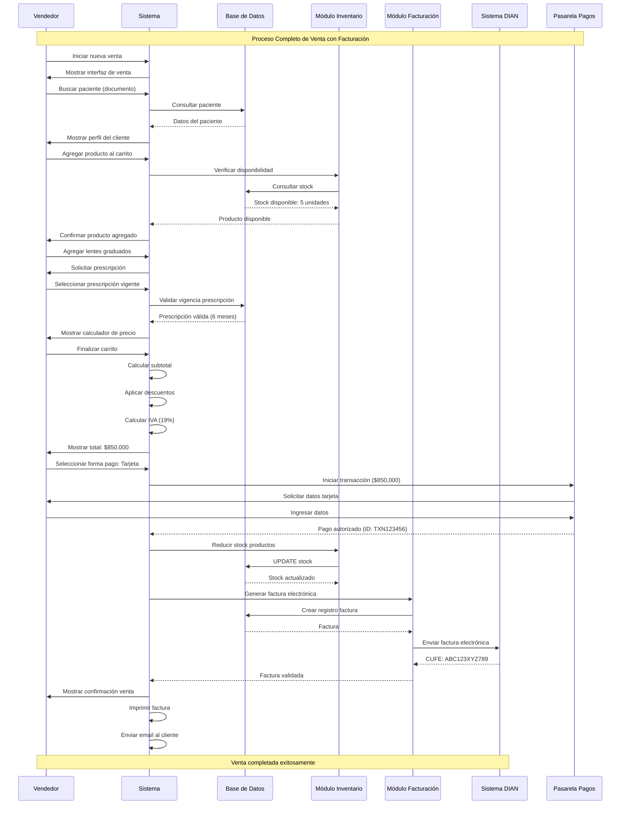
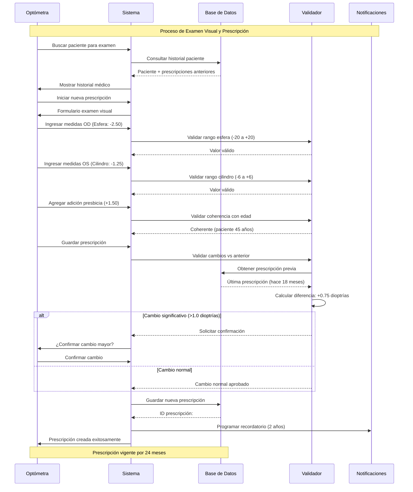
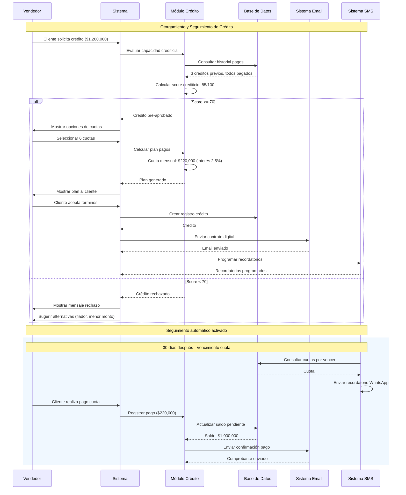
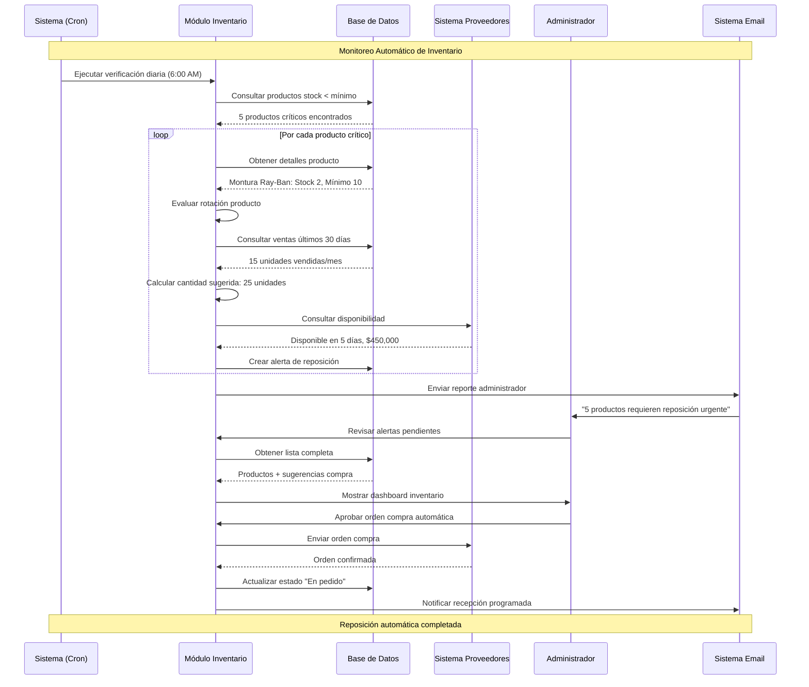
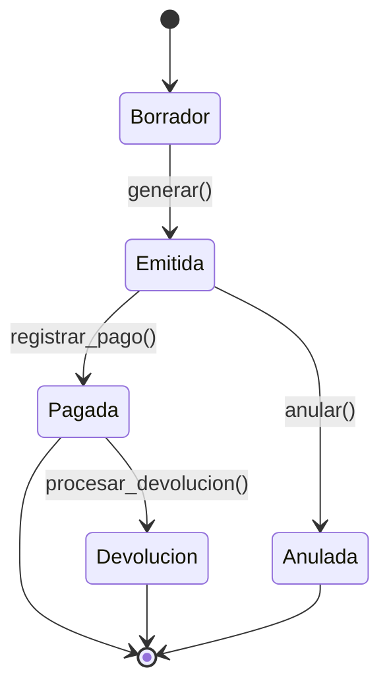
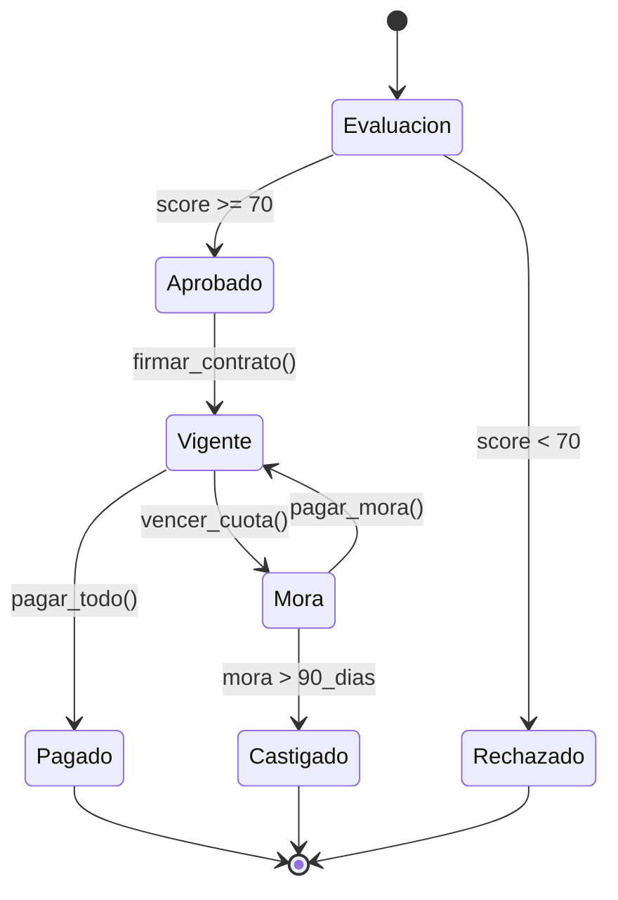

# Diagrama de Secuencia - Sistema Óptica Visual Km 30

## Secuencia 1: Proceso Completo de Venta

## Secuencia 2: Creación de Prescripción Oftalmológica

## Secuencia 3: Proceso de Crédito y Pagos

## Secuencia 4: Gestión de Inventario Automática

## Diagramas de Estados

### Estado de una Factura

### Estado de un Crédito
