# Diagrama de Base de Datos - Sistema Óptica Visual Km 30

```mermaid
erDiagram
    %% Entidad Usuario y Autenticación
    auth_user {
        int id PK
        string username UK
        string email
        string password_hash
        string first_name
        string last_name
        boolean is_active
        datetime date_joined
        datetime last_login
    }

    user_profile {
        int id PK
        int user_id FK
        string rol
        string telefono
        text configuraciones
        datetime created_at
    }

    %% Entidad Paciente
    pacientes {
        int id PK
        string tipo_documento
        string numero_documento UK
        string nombres
        string apellidos
        date fecha_nacimiento
        string telefono
        string email
        text direccion
        text observaciones
        datetime fecha_registro
        datetime fecha_actualizacion
        boolean activo
    }

    %% Entidad Prescripciones
    prescripciones {
        int id PK
        int paciente_id FK
        date fecha_examen
        string profesional
        decimal od_esfera
        decimal od_cilindro
        int od_eje
        decimal os_esfera
        decimal os_cilindro
        int os_eje
        decimal adicion
        decimal distancia_pupilar
        text observaciones
        datetime fecha_registro
        boolean vigente
        int usuario_id FK
    }

    %% Entidad Categoría Productos
    categorias_producto {
        int id PK
        string nombre UK
        string descripcion
        string codigo UK
        boolean activo
        datetime fecha_registro
    }

    %% Entidad Productos
    productos {
        int id PK
        string codigo UK
        string nombre
        int categoria_id FK
        string marca
        string modelo
        text descripcion
        decimal precio_compra
        decimal precio_venta
        int stock_actual
        int stock_minimo
        string imagen_url
        json especificaciones
        boolean activo
        datetime fecha_registro
        int proveedor_id FK
    }

    %% Entidad Proveedores
    proveedores {
        int id PK
        string nit UK
        string razon_social
        string contacto
        string telefono
        string email
        text direccion
        json terminos_comerciales
        boolean activo
        datetime fecha_registro
    }

    %% Entidad Facturas
    facturas {
        int id PK
        string numero_factura UK
        int paciente_id FK
        date fecha
        decimal subtotal
        decimal descuentos
        decimal impuestos
        decimal total
        string estado
        string forma_pago
        string cufe
        text observaciones
        datetime fecha_registro
        int usuario_id FK
    }

    %% Entidad Detalle Facturas
    detalle_facturas {
        int id PK
        int factura_id FK
        int producto_id FK
        int prescripcion_id FK
        int cantidad
        decimal precio_unitario
        decimal descuento_linea
        decimal subtotal
        text especificaciones
    }

    %% Entidad Créditos
    creditos {
        int id PK
        int factura_id FK
        decimal valor_total
        decimal valor_pagado
        decimal saldo_pendiente
        int numero_cuotas
        decimal valor_cuota
        decimal interes_mensual
        date fecha_vencimiento
        string estado
        json plan_pagos
        datetime fecha_creacion
        int usuario_id FK
    }

    %% Entidad Pagos Crédito
    pagos_credito {
        int id PK
        int credito_id FK
        decimal valor_pago
        date fecha_pago
        string medio_pago
        string comprobante
        text observaciones
        datetime fecha_registro
        int usuario_id FK
    }

    %% Entidad Movimientos Inventario
    movimientos_inventario {
        int id PK
        int producto_id FK
        string tipo_movimiento
        int cantidad
        decimal precio_unitario
        string concepto
        string referencia_documento
        datetime fecha_movimiento
        int usuario_id FK
    }

    %% Entidad Órdenes de Trabajo
    ordenes_trabajo {
        int id PK
        int prescripcion_id FK
        int paciente_id FK
        string numero_orden UK
        date fecha_orden
        date fecha_entrega_estimada
        date fecha_entrega_real
        string estado
        text especificaciones_tecnicas
        decimal precio_estimado
        text observaciones
        int usuario_asignado FK
        datetime fecha_registro
    }

    %% Entidad Campañas Marketing
    campanas_marketing {
        int id PK
        string nombre
        text descripcion
        date fecha_inicio
        date fecha_fin
        string tipo_campana
        string canal
        text mensaje
        json segmentacion
        boolean activa
        json estadisticas
        datetime fecha_registro
        int usuario_id FK
    }

    %% Entidad Participantes Campaña
    participantes_campana {
        int id PK
        int campana_id FK
        int paciente_id FK
        datetime fecha_envio
        string estado
        datetime fecha_lectura
        datetime fecha_respuesta
    }

    %% Entidad Configuraciones Sistema
    configuraciones_sistema {
        int id PK
        string clave UK
        text valor
        text descripcion
        string tipo_dato
        datetime fecha_actualizacion
        int usuario_id FK
    }

    %% Entidad Logs de Auditoría
    logs_auditoria {
        int id PK
        int usuario_id FK
        string tabla_afectada
        string accion
        int registro_id
        json valores_anteriores
        json valores_nuevos
        string ip_address
        string user_agent
        datetime fecha_registro
    }

    %% Relaciones principales
    auth_user ||--o| user_profile : "tiene perfil"
    auth_user ||--o{ prescripciones : "crea"
    auth_user ||--o{ facturas : "emite"
    auth_user ||--o{ creditos : "gestiona"
    auth_user ||--o{ logs_auditoria : "genera"

    pacientes ||--o{ prescripciones : "tiene"
    pacientes ||--o{ facturas : "compra"
    pacientes ||--o{ ordenes_trabajo : "solicita"
    pacientes ||--o{ participantes_campana : "participa en"

    categorias_producto ||--o{ productos : "clasifica"
    proveedores ||--o{ productos : "suministra"

    productos ||--o{ detalle_facturas : "se vende"
    productos ||--o{ movimientos_inventario : "registra movimiento"

    prescripciones ||--o{ detalle_facturas : "especifica"
    prescripciones ||--o{ ordenes_trabajo : "genera"

    facturas ||--o{ detalle_facturas : "contiene"
    facturas ||--o| creditos : "puede generar"

    creditos ||--o{ pagos_credito : "recibe"

    campanas_marketing ||--o{ participantes_campana : "incluye"

    %% Índices importantes (comentarios)
    %% pacientes: idx_numero_documento, idx_nombres_apellidos
    %% productos: idx_codigo, idx_categoria_activo
    %% facturas: idx_numero_factura, idx_fecha_estado
    %% prescripciones: idx_paciente_fecha, idx_vigente
    %% movimientos_inventario: idx_producto_fecha, idx_tipo_movimiento
```



## Índices de Base de Datos Recomendados

### 📊 **Índices de Performance**

```sql
-- Pacientes
CREATE INDEX idx_pacientes_documento ON pacientes(numero_documento);
CREATE INDEX idx_pacientes_nombres ON pacientes(nombres, apellidos);
CREATE INDEX idx_pacientes_telefono ON pacientes(telefono);
CREATE INDEX idx_pacientes_activo_fecha ON pacientes(activo, fecha_registro);

-- Prescripciones  
CREATE INDEX idx_prescripciones_paciente ON prescripciones(paciente_id);
CREATE INDEX idx_prescripciones_fecha ON prescripciones(fecha_examen DESC);
CREATE INDEX idx_prescripciones_vigente ON prescripciones(vigente, fecha_examen);

-- Productos
CREATE INDEX idx_productos_codigo ON productos(codigo);
CREATE INDEX idx_productos_categoria ON productos(categoria_id, activo);
CREATE INDEX idx_productos_stock ON productos(stock_actual, stock_minimo);
CREATE INDEX idx_productos_marca_modelo ON productos(marca, modelo);

-- Facturas
CREATE INDEX idx_facturas_numero ON facturas(numero_factura);
CREATE INDEX idx_facturas_paciente ON facturas(paciente_id);
CREATE INDEX idx_facturas_fecha_estado ON facturas(fecha DESC, estado);
CREATE INDEX idx_facturas_usuario ON facturas(usuario_id, fecha DESC);

-- Inventario
CREATE INDEX idx_inventario_producto ON movimientos_inventario(producto_id);
CREATE INDEX idx_inventario_fecha ON movimientos_inventario(fecha_movimiento DESC);
CREATE INDEX idx_inventario_tipo ON movimientos_inventario(tipo_movimiento);

-- Créditos
CREATE INDEX idx_creditos_factura ON creditos(factura_id);
CREATE INDEX idx_creditos_estado ON creditos(estado, fecha_vencimiento);
CREATE INDEX idx_creditos_vencimiento ON creditos(fecha_vencimiento);

-- Logs de Auditoría
CREATE INDEX idx_auditoria_usuario ON logs_auditoria(usuario_id, fecha_registro DESC);
CREATE INDEX idx_auditoria_tabla ON logs_auditoria(tabla_afectada, accion);
CREATE INDEX idx_auditoria_fecha ON logs_auditoria(fecha_registro DESC);
```

### 🔧 **Constraints y Validaciones**

```sql
-- Validaciones de negocio
ALTER TABLE prescripciones ADD CONSTRAINT chk_esfera_range 
CHECK (od_esfera BETWEEN -20.00 AND 20.00 AND os_esfera BETWEEN -20.00 AND 20.00);

ALTER TABLE prescripciones ADD CONSTRAINT chk_cilindro_range
CHECK (od_cilindro BETWEEN -6.00 AND 6.00 AND os_cilindro BETWEEN -6.00 AND 6.00);

ALTER TABLE prescripciones ADD CONSTRAINT chk_eje_range
CHECK (od_eje BETWEEN 0 AND 180 AND os_eje BETWEEN 0 AND 180);

ALTER TABLE productos ADD CONSTRAINT chk_precios_positivos
CHECK (precio_compra >= 0 AND precio_venta >= 0 AND precio_venta >= precio_compra);

ALTER TABLE productos ADD CONSTRAINT chk_stock_positivo
CHECK (stock_actual >= 0 AND stock_minimo >= 0);

ALTER TABLE creditos ADD CONSTRAINT chk_valores_positivos
CHECK (valor_total > 0 AND numero_cuotas > 0 AND valor_cuota > 0);

ALTER TABLE facturas ADD CONSTRAINT chk_totales_coherentes
CHECK (total = subtotal - descuentos + impuestos);
```

### 📈 **Vistas Útiles para Reportes**

```sql
-- Vista: Pacientes con última prescripción
CREATE VIEW v_pacientes_prescripcion_actual AS
SELECT 
    p.id,
    p.numero_documento,
    p.nombres,
    p.apellidos,
    pr.fecha_examen as ultima_prescripcion,
    pr.vigente
FROM pacientes p
LEFT JOIN prescripciones pr ON p.id = pr.paciente_id
WHERE pr.id = (
    SELECT id FROM prescripciones pr2 
    WHERE pr2.paciente_id = p.id 
    ORDER BY fecha_examen DESC LIMIT 1
);

-- Vista: Productos con stock crítico
CREATE VIEW v_productos_stock_critico AS
SELECT 
    p.codigo,
    p.nombre,
    p.stock_actual,
    p.stock_minimo,
    (p.stock_minimo - p.stock_actual) as deficit,
    c.nombre as categoria
FROM productos p
JOIN categorias_producto c ON p.categoria_id = c.id
WHERE p.stock_actual <= p.stock_minimo 
AND p.activo = true;

-- Vista: Resumen de ventas diarias
CREATE VIEW v_ventas_diarias AS
SELECT 
    DATE(f.fecha) as fecha_venta,
    COUNT(*) as total_facturas,
    SUM(f.total) as total_ventas,
    AVG(f.total) as venta_promedio,
    COUNT(DISTINCT f.paciente_id) as clientes_unicos
FROM facturas f
WHERE f.estado = 'Pagada'
GROUP BY DATE(f.fecha);
```